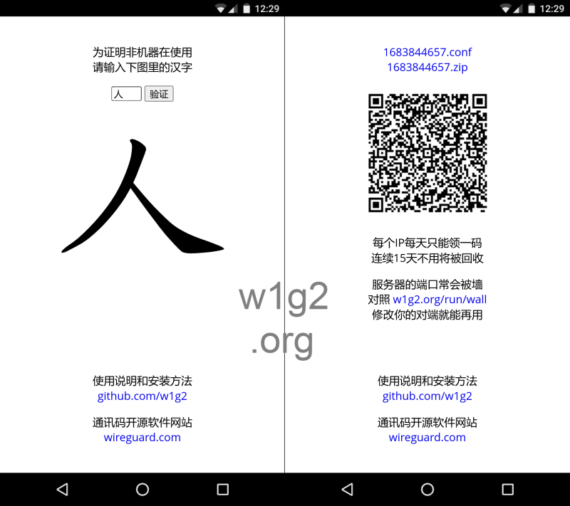

<!---
- 👋 Hi, I’m @w1g2
- 👀 I’m interested in ...
- 🌱 I’m currently learning ...
- 💞️ I’m looking to collaborate on ...
- 📫 How to reach me ...

w1g2/w1g2 is a ✨ special ✨ repository because its `README.md` (this file) appears on your GitHub profile.
You can click the Preview link to take a look at your changes.
--->

[w1g2.com]: https://104.200.28.75 "w1g2.com"
[w1g2.com/run/wall]: https://104.200.28.75/run/wall "w1g2.com/run/wall"
[w1g2.com/run/qa]: https://104.200.28.75/run/qa "w1g2.com/run/qa"
[w1g2.com/run/q/101]: https://104.200.28.75/run/q/101 "w1g2.com/run/q/101"
[w1g2.com/run/use]: https://104.200.28.75/run/use "w1g2.com/run/use"
[w1g2.com/run/node]: https://104.200.28.75/run/node "w1g2.com/run/node"
[w1g2.com/run/isp]: https://104.200.28.75/run/isp "w1g2.com/run/isp"
[w1g2.com/run/top]: https://104.200.28.75/run/top "w1g2.com/run/top"
[w1g2.com/run/sta]: https://104.200.28.75/run/sta "w1g2.com/run/sta"
[w1g2.com/run/stat]: https://104.200.28.75/run/stat "w1g2.com/run/stat"
[wireguard]: https://wireguard.com/install "wireguard.com/install"

## [w1g2.com][] (ip: 104.200.28.75)
w1g2.com 是使用 WireGuard 开源技术的公益翻墙 VPN。为了抗墙，以上链接是域名的数字地址而不是平常的域名地址，浏览器会显示安全警告，点击 Advanced，确认证书是赋予 www.w1g2.com 的，然后选择继续。

在使用 w1g2.com 前，你需要从开源网站 [WireGuard][] 下载和安装适合你系统的软件（国内用户请额外参考本页底部的 __安装方法__）。WireGuard 的技术设计和安全考虑都是一流的，已融入 Linux 系统的内核，服务器端和用户端的软件全部开源，质量有保证，没有见不得人的黑箱。

安装成功后，在 w1g2.com 首页上输入一个汉字，认证正确后会显示一个二维通信码和相应的 zip/conf 文件链接，最后：
* 手机系统可以扫描通信码，也可以下载导入码上面的 zip（安卓手机）或 conf 文件
* 计算机系统直接下载 conf 文件，再导入到安装好的程序中
* 在 conf 文件的链接上，按右键显示内容在新的页面上，可以用于手动输入设置

一个 IP 一天只能领取一个 WireGuard 通信码，但通信码是可以共享的，你几个手机和计算机可以只用一个，不影响任何一个的速度，只有在几个同时用时，才会影响他们的速度。

---
### 使用说明
* [w1g2.com/run/wall][] : 节点群组的对端（Endpoint）  
服务器的 ip 或 port 可能时不时被墙，确认后服务器会做一定的调整然后重启，这时你的 __WireGuard 节点肯定不工作了，证明就是，WireGuard 的传输统计栏里的接受数字不会再增加__。发生这种情况后，用你的局域网 IP 地址（Address），在网页里找到对应的（192.168.1??.*/24）行，同一行开头的 __ip:port__，必须符合你的对端（Endpoint），如果不符合，手动修改后可以继续工作。

* [w1g2.com/run/qa][] : 节点最后一次使用的日期和有效公钥的前8位  
过去60天内没被人用过的节点会被服务器回收利用，按节点最后使用的日期来排，需要一个新的，就回收一个。另外还可以用 [w1g2.com/run/q/101][] 只查看第1个节点群组，这里101是局域网IP(192.168.101.*)的第3节，以此类推，用102~109替代101可以查看第2个到第9个节点群组。

* [w1g2.com/run/use][] : 当天连过线的节点和当前在线的节点（最右端有[n]标志）  
每个当天用过的节点都会列出来，加上它们上一次连接是多少时间之前，以及它们上传和下载的流量。另外成功开通 WireGuard 后，w1g2.com 首页也会显示你的节点今天的流量累计。

* [w1g2.com/run/node][] : 当天上传和下载的流量总和超过 1000(MB) 的节点  
一个机器一天内可能用过多个节点，如果这些节点的上传和下载流量总和超过 __2000(MB)__，服务器会封这个机器的 IP 地址，直到第二天零点所有节点清零，服务器重新开始计算。__你的机器 IP 被封后，你必须断开 WireGuard，否则哪里都去不了__，想核实的话，断开后可以去 w1g2 首页，首页会告诉你的机器 IP 是否已被封，没有的话会显示正常首页。

---
### 网站公示
* [w1g2.com/run/isp][] : 当天用过翻墙从中国来的服务商

* [w1g2.com/run/top][] : 服务器实时运行的全部后台程序

* [w1g2.com/run/sta][] : 服务器过去30天的运行数据总结

* [w1g2.com/run/stat][] : 用户节点过去10天的运行数据总结

---
### 安装方法
* __安卓手机__  
无法用谷歌 Play Store 直接安装 WireGuard 的中国安卓手机，可以去 WireGuard 官方网站，注意在 Android 的 [Download from Play Store][wireguard] 下面有 F-Droid 的链接，从那里可以直接下载 APK 文件，然后手动在安卓手机上安装。这个链接列在 WireGuard 的官方网页里，等于有他们团队的背书。

* __苹果手机__  
用中国区账号的苹果手机，必须先在 App Store（不是手机设置）里退出，再暂时登录一个美国区账号，然后搜索下载安装 WireGuard，最后退出再登录原来的中国区账号。下面链接的知乎文章详细解释了怎么登记一个新的美国区账号：  
[【2022年】五分钟注册美区Apple ID，手把手教，稳定且耐用！](https://zhuanlan.zhihu.com/p/367821925)

* __Windows 系统__  
WireGuard 网站为 Windows 系统提供的 EXE 安装文件，安装过程中需要联系他们自己的网站下载适合你机器的 MSI 文件，但网站本身就是被墙的，所以安装会失败。注意在 [Download Windows Installer][wireguard] 链接下面，还有一个 [Browse MSIs] 的链接，点进去以后，使用一般计算机的人，选第一个 MSI 下载安装。
